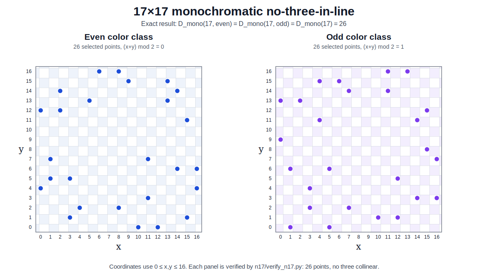

# Case `17×17`

This folder contains the exact verified result for the monochromatic no-three-in-line problem on the `17×17` checkerboard grid.

## Result

We prove:

```text
D_mono(17, even) = 26
D_mono(17, odd)  = 26
D_mono(17)       = 26
```

In words:

> On either color class of the `17×17` checkerboard grid, the maximum number of same-color grid points with no three chosen points on a line is exactly `26`.

The two color classes are:

```text
even: (x + y) % 2 == 0
odd:  (x + y) % 2 == 1
```

The coordinate system is:

```text
0 <= x,y <= 16
```

## Visualization

The exact 26-point configurations for both color classes are shown below.



## What is included

This folder is meant to be easy to reproduce and check.

```text
README.md
configurations.json
certificates.json
verify_n17.py
boards.md
n17_configurations.svg
```

- `configurations.json` contains explicit configurations of 26 points for both color classes.
- `certificates.json` contains exact rational upper-bound certificates.
- `verify_n17.py` checks the configurations and certificates using only the Python standard library.
- `boards.md` shows the two configurations as simple text boards.
- `n17_configurations.svg` shows the two exact configurations as a repository-friendly SVG figure.

## How to verify

From this folder, run:

```bash
python verify_n17.py
```

Expected output:

```text
even: configuration verified (26 points, no collinear triple).
odd: configuration verified (26 points, no collinear triple).
even: certificate verified (upper bound = 1788/67 = 26.686567164179, minimum cover = 1 at ...).
odd: certificate verified (upper bound = 80/3 = 26.666666666667, minimum cover = 1 at ...).

Result verified:
D_mono(17, even) = D_mono(17, odd) = D_mono(17) = 26
```

The exact point where the minimum cover is attained is not important; it is printed only as an additional diagnostic.

## Proof outline

The proof has two parts.

### 1. Lower bound

The file `configurations.json` gives a configuration of 26 points for each color class.

The verifier checks directly that:

- all listed points lie on the `17×17` grid;
- all listed points have the required parity;
- the points are distinct;
- no three listed points are collinear.

Therefore:

```text
D_mono(17, even) >= 26
D_mono(17, odd)  >= 26
```

### 2. Upper bound

The file `certificates.json` gives rational weights on four families of lines:

- rows `y`;
- columns `x`;
- diagonals `x - y`;
- diagonals `x + y`.

Every allowed grid point is covered by total weight at least `1`.

Any valid no-three-in-line configuration has at most two chosen points on each of these lines. Therefore twice the total weight gives an upper bound for the number of chosen points.

For the even color class, the certificate gives:

```text
1788 / 67 = 26.686567... < 27
```

For the odd color class, the certificate gives:

```text
80 / 3 = 26.666666... < 27
```

Since the number of chosen points is an integer, both bounds imply that 27 points are impossible.

Thus:

```text
D_mono(17, even) <= 26
D_mono(17, odd)  <= 26
```

Together with the explicit configurations of 26 points, this proves the exact value.

## Why this folder exists

The repository is organized by board size. Each solved size should have its own folder with:

- configurations;
- certificates;
- a small independent verifier;
- a readable explanation;
- optional search notes or visualizations.

This makes the project easier to inspect and extend. A reader should not need to trust a large search program. They should be able to enter one folder, run one small script, and check the result independently.
